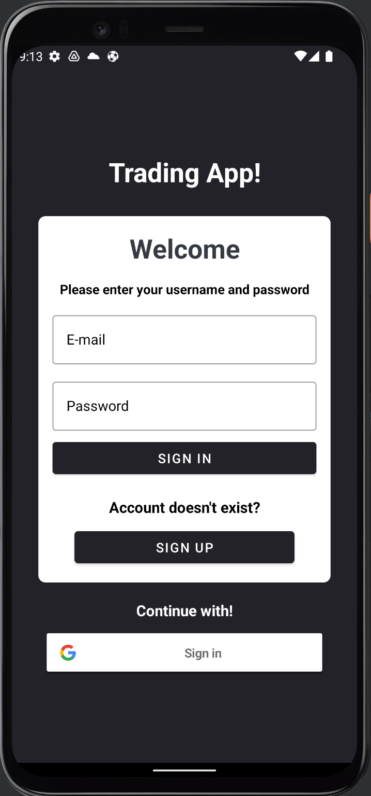
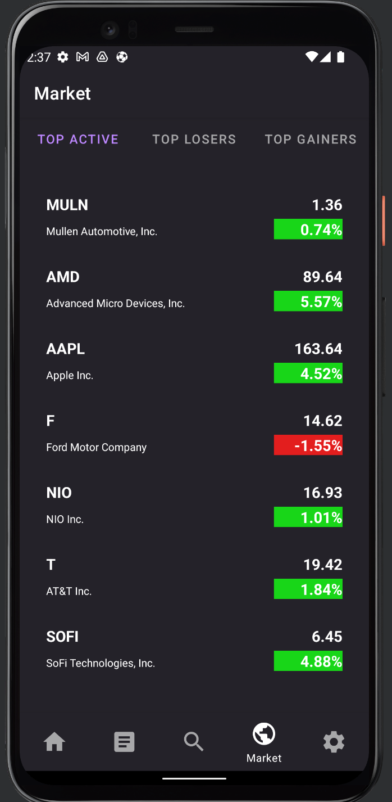
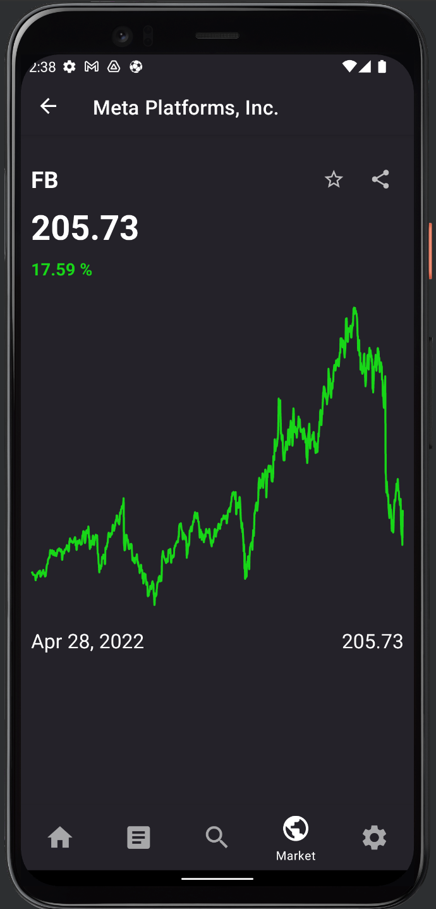
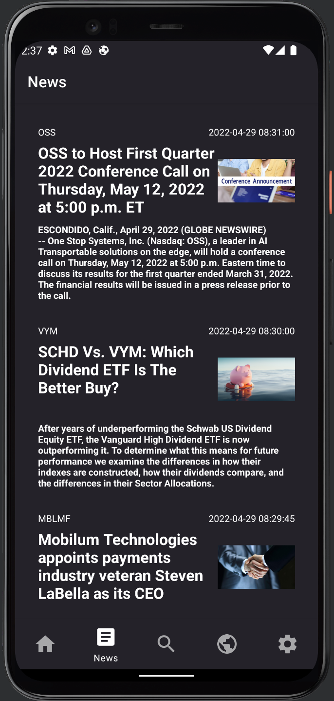
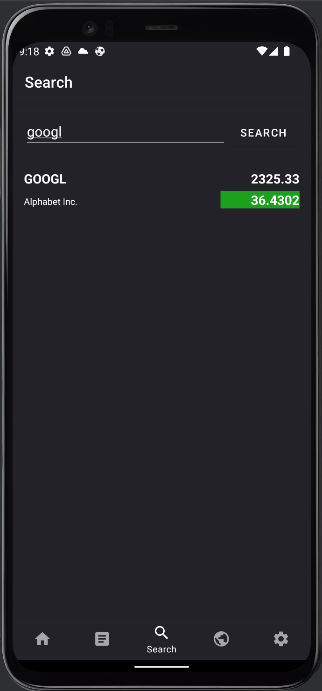
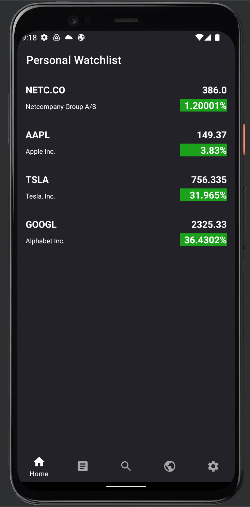
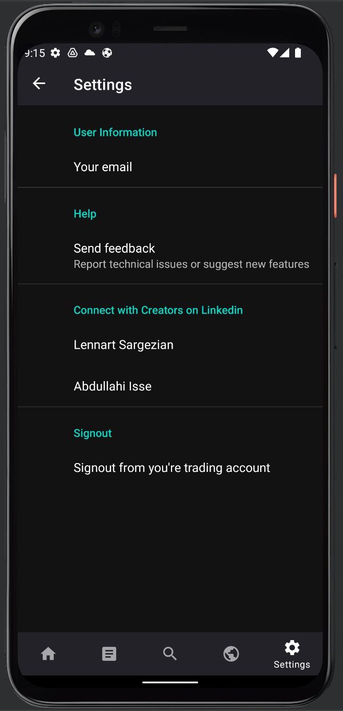

# MyTradingApp
This is an application for keeping track of all your beloved stocks. 
MyTradingApp provides a graphical way to display stock data, which includes price, news, trends and an personal watchlist and more.

My motivation behind the creation of this app, is that i have got tired of stock apps that are to complex and has a ugly UI-design. 

The goal of this app is to be as user friendly as possible and have a nice mordern UI design. 

Demonstration of app:
https://www.youtube.com/watch?v=mx_WdmEgtWo

# Prioritized requirements

- Requirements are divided into prioritized levels by critical, medium and low

### Critical:
- [x] As a user, i want to be able to see specific information for each stock (symbolname, price, description), such that i can keep myself updated for the specific stock.
- [x] As a user, i want to be able to have a search bar to be able to look for stocks by tickername, such that i can browse for my desired stock i am looking for. 
- [x] As a user, i want to be able to see a chart that display price data plotted on a line graph, such that i can gain an inside of the prices changes over time.
- [x] As a user, i want to be able to add a stock to my personal watchlist, such that i can gain a overview of my favorites stock to watch.
- [x] As a user, i want to be able to remove a stock from my personal watchlist, such that i can unfollow a stock that i am not interested in. 
- [x] As a user, i want to be able to have a Trending tickers page, such that i can gain an inside of which stocks are up-trending or down-trending for the specific day. 
- [x] As a user, i want to be able to have a News page, such that i can collect important news about todays market. 
 
### Medium:
- [x] As a user, i want to be able to have a settings page, such that i can personalize my account by my needs.
- [x] As a user, i want to be able to signup, login and signout, such that i can login to my personal stock account. 

### Low:
- [x] As a user, i want to be able to share a stock to a friend by email. 
- [ ] As a user, i want to be able to see a others users watchlist such that I can gain a inside of other users prefered stocks. 
- [ ] As a user, i want to be able to search and see a list of users, so that i can gain an inside of theirs account.  
- [x] As a user, i want to be able to signup and login with a google account

# Screenshots

### Login:

### MarketWatch

### Graph

### StockNews

### Search

### Watchlist

### Setting

### Video

